# 星宝守护 StarGuard · 特殊儿童情绪与行为识别系统

> 仓库名：`Star-Baby`（GitHub: https://github.com/kll237/Star-Baby）
> 应用标题：心语守护 · 特殊儿童情绪与行为识别系统

星宝守护是一套面向**特殊儿童（自闭症谱系、ADHD、情绪障碍等）**的情绪与动作行为**实时识别 + 智能安抚干预**的 Web 系统。它把摄像头采集到的画面在**浏览器本地**完成情绪与动作分析，并把结果通过 WebSocket 实时推送到家长 / 教师端看板，在检测到持续负向情绪或高危行为时自动触发安抚对话、危机提示与专业建议，帮助看护者更及时、更客观地了解孩子状态。

系统定位是**可本地运行、可自托管、隐私友好**的看护辅助工具：人脸特征在本地加密存储，识别与推理全部在客户端完成，服务端只负责任务编排、数据落库与多端同步。

---

## 一、核心功能与界面实拍

> 下面 15 张截图按「使用流程」顺序排列，对应系统从登录到报告导出的主要界面。
> 说明：截图由作者本地运行实例截取；由于撰写文档时无法逐张肉眼核对，个别画面顺序如有偏差，请以实际界面为准。

### 1) 登录 / 注册

家长端与教师端通过账号密码登录，支持注册、短信验证、找回密码。

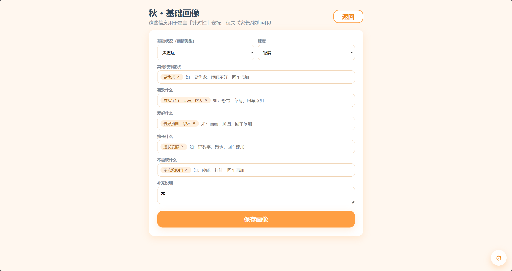
*图 1：登录界面（家长 / 教师双角色入口）。*

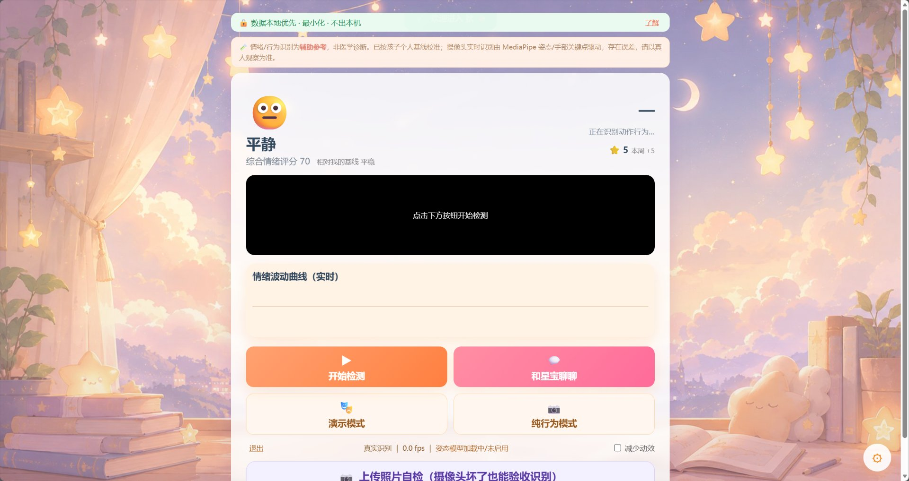
*图 2：注册界面（手机号 + 短信验证码 + 角色选择）。*

### 2) 家长 / 教师数据看板

看板聚合孩子的情绪趋势、风险事件、行为频次、安抚与干预统计，支持按日 / 周 / 月分桶查看。

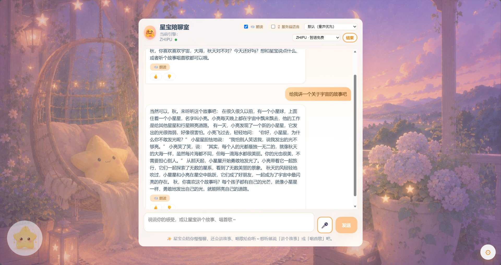
*图 3：家长端看板——情绪趋势折线（状态分 + 负面占比）、主导情绪 / 行为频次分布。*

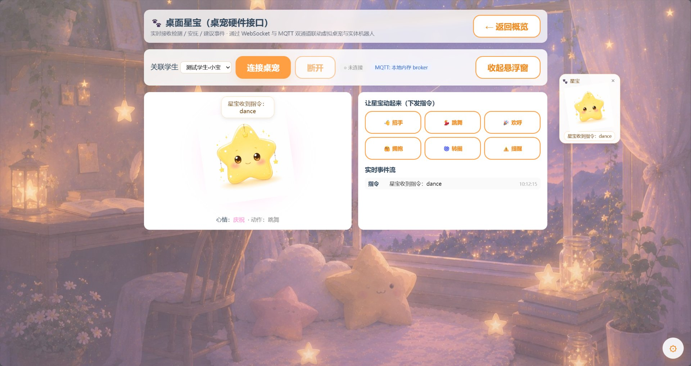
*图 4：教师端看板——与所看护学生数据一致，便于家校协同。*

### 3) 学生端实时检测大屏

学生端授权摄像头后，实时识别情绪（含复杂情绪）与动作行为，画面叠加当前情绪 / 行为标签与综合状态分。

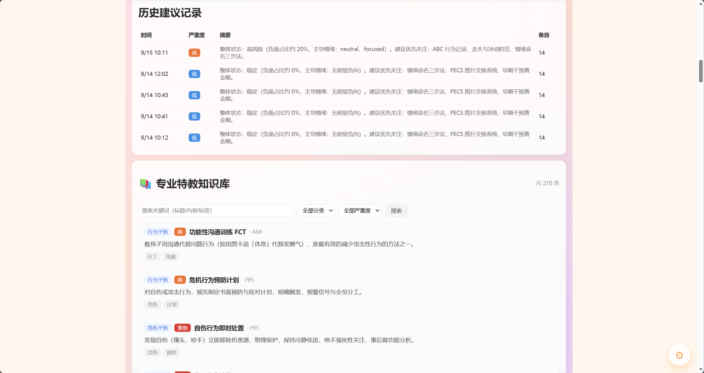
*图 5：学生端实时检测大屏——摄像头画面 + 实时情绪 / 行为标签。*

### 4) 通知与危机提示

右上角铃铛汇总风险事件；检测到高危行为（如自伤、跌倒、撞头）或持续负向情绪时弹出危机提示，引导立即关注。

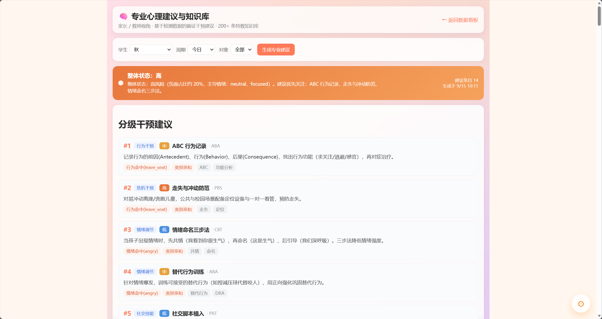
*图 6：通知铃铛与事件面板——按时间汇总风险事件，点击可定位。*

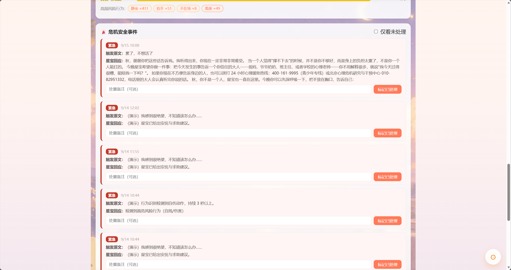
*图 7：危机提示弹窗——高危行为 / 持续负向时即时提醒看护者。*

### 5) 照片自检（隐私替代方案）

家长可上传一张孩子照片做**一次性**情绪 / 行为自检，用于无法开摄像头的场景；明确标注「仅本地分析、不留存」。

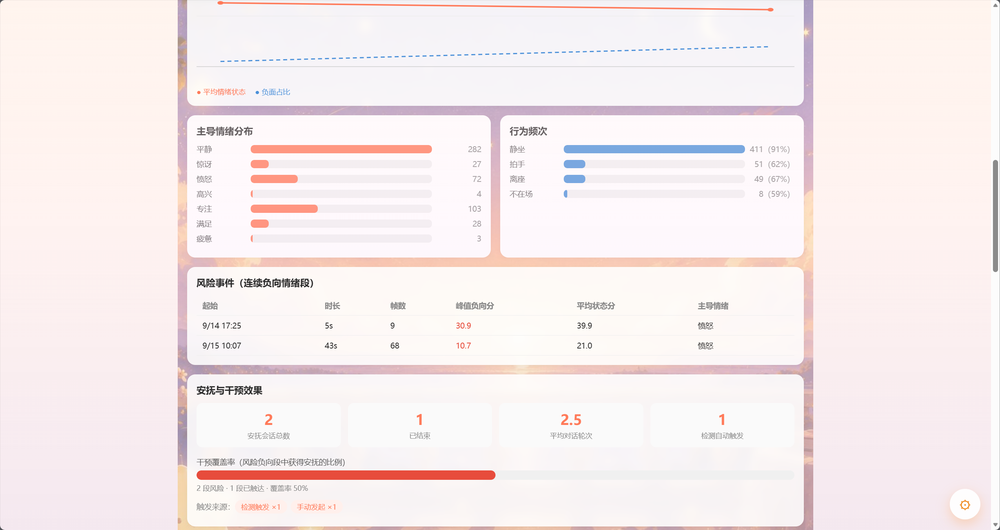
*图 8：照片自检入口与结果——本地 MediaPipe 推理，不上传服务端。*

### 6) 行为识别（跌倒 / 打架 / 久坐 / 击打 / 撞头等）

基于姿态关键点与帧差的运动分析，识别跌倒、多人冲突（打架）、击打手臂、撞头、久坐超时等，并按风险优先级上报。

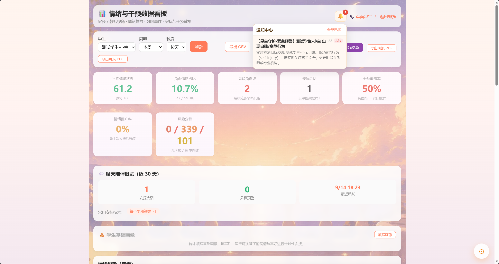
*图 9：行为识别结果——跌倒 / 打架 / 击打 / 撞头 / 久坐等标签与风险等级。*

### 7) 复杂情绪识别

在 7 类基础表情之上，融合面部几何（眼/嘴开合、眉形、头姿）+ 运动特征，合成 14 类复杂情绪（如困惑、焦虑、兴奋、疲惫、受挫、专注、满足等）。


*图 10：复杂情绪展示——多维度合成的细粒度情绪状态。*

### 8) 智能安抚聊天

检测到持续负向情绪时自动开启安抚会话，内置 CBT / 正念 / 呼吸 / 着陆等话术库，支持浏览器端 TTS 朗读与语音输入，可切换规则 / LLM 引擎。

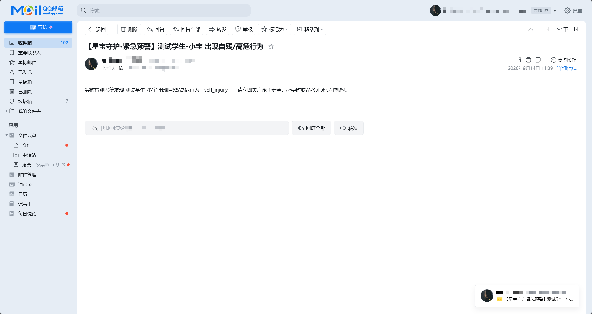
*图 11：安抚聊天界面——多轮对话 + 语音朗读 / 识别。*

### 9) 虚拟桌宠联动

检测 / 风险 / 安抚 / 建议事件统一映射为「星宝」桌宠的心情与动画，提供悬浮陪伴模式与手动指令，并预留真实硬件（机器人 / 屏幕）MQTT 接口。

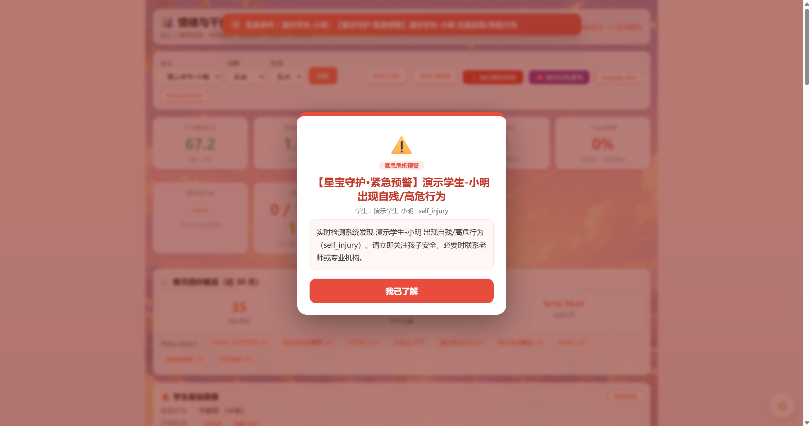
*图 12：虚拟桌宠「星宝」——随孩子状态变化的心情与动画联动。*

### 10) 专业心理建议

基于学生画像（负面占比 / 主导情绪 / 行为频次 / 高危行为）从循证知识库生成分级专业建议，知识库覆盖 ABA、TEACCH、正念、CBT、PECS、感觉统合等流派。

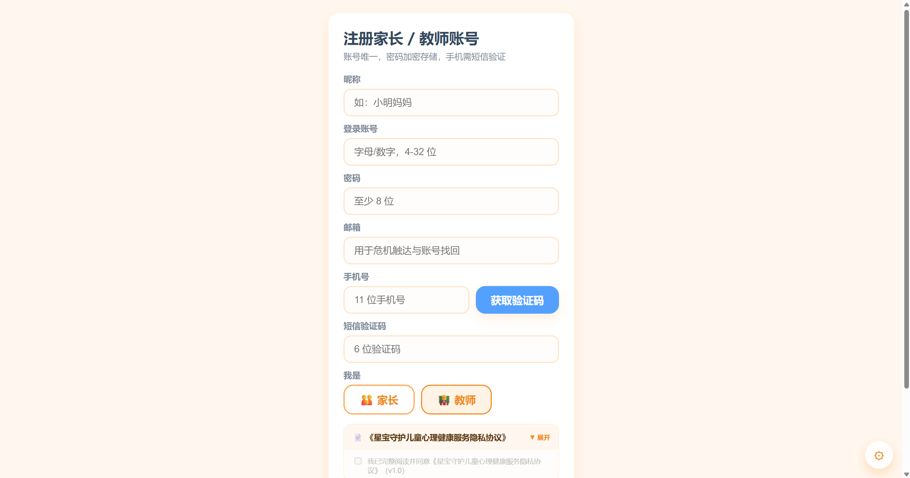
*图 13：专业建议界面——严重度横幅 + 分级建议卡（含来源与理由）。*

### 11) 报告导出

看板可一键导出 JSON / CSV / PDF 报告，包含情绪趋势、风险事件、行为频次、干预覆盖率等，便于与老师 / 医生沟通。

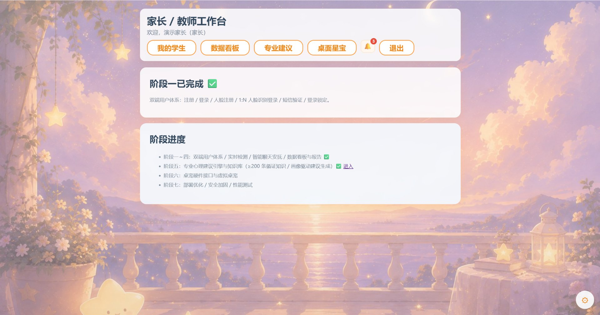
*图 14：报告导出——PDF / JSON / CSV 多种格式下载。*

### 12) 部署与运行

单端口 HTTPS 部署：后端同时托管前端页面、API 与 WebSocket（同源，无跨域），家长用手机 / 平板在同一局域网即可访问。

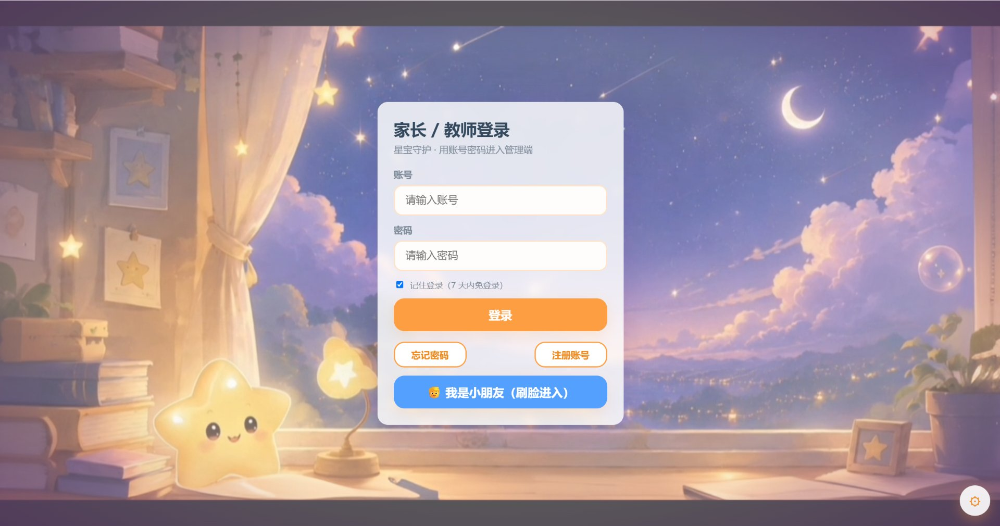
*图 15：本地 / 局域网部署后的访问效果（单端口 HTTPS，摄像头需安全上下文）。*

---

## 二、技术架构

| 层 | 选型 |
| --- | --- |
| 前端 | Vue 3 + TypeScript + Vite + Pinia + Vue Router；face-api.js（人脸特征）、@mediapipe/tasks-vision（姿态 / 手部）、html2canvas + jsPDF（报告导出） |
| 后端 | Node.js + NestJS + TypeScript；RESTful + Socket.IO（WebSocket 网关） |
| 主数据库 | PostgreSQL（Prisma ORM） |
| 缓存 / 会话 / 限流 | Redis（缺失时自动降级内存） |
| 安全 | JWT（7 天）+ bcrypt + AES-256-GCM 加密人脸特征 + 审计日志 |
| 桌宠硬件总线 | 内置零依赖 MQTT Broker（可切换真实 Mosquitto / EMQX） |
| 部署 | 单端口 HTTPS（后端托管前端）/ Docker·Compose（Postgres + Redis + MQTT + 后端 + 前端 Nginx + Let's Encrypt） |

```
浏览器(学生/家长/教师端, 摄像头在本地)
      │  HTTPS / WSS (同源单端口)
      ▼
┌─────────────┐     ┌──────────────────────┐
│  Vue 3 SPA  │◀───▶│  NestJS 后端 API/WS   │
└─────────────┘     └──────────┬───────────┘
                               │
              ┌────────────────┼────────────────┐
              ▼                ▼                ▼
         PostgreSQL       Redis(可选)      MQTT Broker(可选)
         (主数据/人脸)   (限流/会话/WS适配) (桌宠硬件联动)
```

**识别在哪里发生？** 情绪与动作识别全部在**学生端浏览器本地**完成（face-api.js + MediaPipe + 帧差），不把摄像头画面传回服务端，仅在本地得出结论后把**结构化结果**（情绪标签、行为标签、状态分）上报。这既保护了孩子隐私，也降低了服务端算力成本。

---

## 三、目录结构

```
.
├── backend/                # NestJS 后端
│   ├── prisma/             # Schema + 种子数据（schema.prisma / seed.ts）
│   ├── src/
│   │   ├── auth/           # 注册/登录/刷新/找回密码
│   │   ├── users/          # 学生管理（家长/教师）
│   │   ├── face/           # 人脸注册 / 1:N 识别 / 二次验证（AES 加密）
│   │   ├── detection/      # 实时检测（REST + WebSocket 网关 + 纯函数算法）
│   │   ├── chat/           # 智能聊天安抚（话术库/LLM可切换/TTS·ASR）
│   │   ├── report/         # 数据看板与报告（聚合/导出 JSON·CSV·PDF）
│   │   ├── advice/         # 专业心理建议引擎与知识库
│   │   ├── deskpet/        # 桌宠硬件接口（反应映射/MQTT/WebSocket/设备与事件）
│   │   ├── cache/          # Redis 缓存层封装（缺失降级内存）
│   │   ├── common/         # JWT/角色守卫、安全响应头中间件
│   │   ├── security/       # AES-256-GCM 加密
│   │   ├── sms/            # 短信服务（dev/阿里云/腾讯云可插拔）
│   │   ├── audit/          # 审计日志
│   │   └── scripts/        # 零依赖 HTTP 压测脚本
│   ├── test/               # 集成测试（e2e）
│   ├── Dockerfile
│   └── .env.example        # 完整环境变量清单
├── frontend/               # Vue 3 前端
│   ├── src/
│   │   ├── api/            # 后端 API 客户端
│   │   ├── store/          # Pinia 状态
│   │   ├── utils/          # face.ts / pose.ts / behavior.ts / complexEmotion.ts
│   │   └── views/         # 登录/注册/学生管理/人脸注册/刷脸登录/实时检测/安抚聊天/家长看板/教师看板/专业建议/桌宠
│   ├── public/models/      # face-api 权重（已随仓库提供，开箱即用）
│   ├── nginx/              # 生产 Nginx 反代 + 限流配置
│   └── Dockerfile
├── docs/
│   ├── ARCHITECTURE.md     # 架构与数据库 ER 说明
│   ├── ER.md
│   └── screenshots/        # 本 README 引用的界面实拍（15 张）
├── deploy/                 # 公网 HTTPS 部署包（.env.production + README + k6 压测）
├── mqtt/                   # Mosquitto 配置
├── docker-compose.yml      # 公网一键编排（Postgres+Redis+MQTT+后端+前端Nginx+Certbot）
├── docker-compose.local.yml# 本地依赖编排
├── start-app.bat           # Windows 单端口启动脚本
├── start-deps.bat          # Windows 本地依赖（Redis/MQTT/MailHog）启动脚本
└── README.md
```

> 说明：仓库**只包含上述有用文件**。构建产物（`dist*`）、`node_modules`、日志、测试缓存、自签证书（含私钥）、`.env` 密钥、AI 工作区目录等均已通过 `.gitignore` 排除，不会上传。

---

## 四、环境要求与依赖

| 依赖 | 版本 / 说明 | 是否必需 |
| --- | --- | --- |
| Node.js | ≥ 18（推荐 20 / 22）。本机用 22.22.2 验证 | 必需 |
| npm | 随 Node 安装 | 必需 |
| PostgreSQL | ≥ 14（推荐 16） | 必需（识别结果落库） |
| Redis | ≥ 6（推荐 7） | 可选（缺失自动降级内存） |
| MQTT Broker | Mosquitto / EMQX | 可选（缺失用内置内存 Broker） |
| 浏览器 | Chrome / Edge（需支持 getUserMedia、WebGL） | 必需（学生端摄像头） |
| Docker / Docker Compose | 任意较新版本 | 仅 Docker 部署时需要 |

**前端关键依赖库**：`vue` `vue-router` `pinia` `axios` `socket.io-client` `face-api.js`（表情/人脸）`@mediapipe/tasks-vision`（姿态/手部）`html2canvas` `jspdf` `jspdf-autotable`（报告导出）。

**后端关键依赖库**：`@nestjs/*`（core/platform-express/platform-socket.io/websockets/jwt/config/throttler/swagger）`@prisma/client` `bcryptjs` `class-validator` `class-transformer` `ioredis` `@socket.io/redis-adapter` `mqtt` `socket.io` `uuid` `reflect-metadata` `rxjs`，以及 `edge-tts-universal`（服务端 TTS 可选）。

---

## 五、快速开始

### 方式一：Docker 一键部署（公网 / 远程服务器）

适合把系统部署到一台有公网 IP 的服务器，并用真实域名 + Let's Encrypt 免费证书提供 HTTPS。

```bash
# 1) 准备部署变量
cp deploy/.env.production deploy/.env.production.local
# 编辑：填入 DOMAIN（你的域名）、EMAIL、DB_PASSWORD、REDIS_PASSWORD 等

# 2) 把域名 A 记录指向本机公网 IP，并开放 80/443 入站

# 3) 启动全部服务（首次自动建表）
docker compose --env-file deploy/.env.production up -d --build

# 4) 首次签发证书
docker compose run --rm certbot certonly

# 5) 加载 443 配置
docker compose restart frontend

# 6) 浏览器访问 https://<你的域名>
```

> 端口策略：仅暴露 80/443，数据库 / Redis / MQTT 不映射宿主机端口；TLS 由前端 Nginx 终止，后端仅跑内网 HTTP。

### 方式二：本地源码直接运行（单端口 HTTPS，看效果最快）

后端会**直接托管前端构建产物**，API、网页、WebSocket 同在**同一端口**，无需 dev 代理 / 跨域。适合本机或局域网内用手机 / 平板协同看护。

```bash
# 1) 准备数据库（PostgreSQL 必需；Redis/MQTT 可缺省）
createdb spchild                       # 或 psql 建库
cd backend
cp .env.example .env                  # 按需修改（见第六节）
npm install
npx prisma generate
npx prisma db push                    # 建表
npm run seed                          # 写入演示账号（parent01 / teacher01）

# 2) 构建并启动后端（默认托管前端）
npm run build
node dist/main.js                     # 端口由 .env 的 PORT 控制（示例 3300）

# 3) 构建前端（仅首次 / 改了前端代码时需要）
cd ../frontend
npm install
npm run build                        # 产物输出到 frontend/dist_tmp2（见 VITE_API_BASE）

# 4) 浏览器访问（同端口）
#    网页:  https://localhost:3300/      （注意：摄像头需要 HTTPS 或 localhost 安全上下文）
#    API:   https://localhost:3300/api/health
```

> 端口说明：代码默认 `PORT=3000`；仓库自带的 `start-app.bat` 用 `3200`；作者本地运行实例用 `3300`（`.env` 中 `PORT=3300` + 自签 HTTPS）。端口完全可配置，三者都正确，按你的 `.env` 为准。

> 单端口 HTTPS（手机 / 平板开摄像头必须）：`ENABLE_HTTPS=true` 时后端用 `backend/certs/` 下自签证书（SAN 已含 `localhost` 与局域网 IP）。首次需先生成证书，或让手机信任自签证书（Android：高级→继续；iOS：安装 `server.der` 并在证书信任设置启用）。若不想处理证书，开发态用 `http://localhost:<PORT>`（localhost 属安全上下文，摄像头可用）。

**Windows 一键脚本**：双击根目录 `start-app.bat` 可自动构建并以后端单端口（默认 3200）启动；本地依赖（Redis / MQTT / MailHog）用 `start-deps.bat` 启动。

### 方式三：前后端分离开发模式

```bash
# 终端 A：后端
cd backend && npm install
docker compose up -d postgres redis     # 或已有本地 PG/Redis
npx prisma db push && npm run seed
npm run start:dev                        # 监听 3000

# 终端 B：前端
cd frontend && npm install
npm run dev                              # http://localhost:5173，自动代理 /api → 后端
```

---

## 六、配置说明（backend/.env 关键项）

完整清单见 `backend/.env.example`。常用项：

| 变量 | 说明 |
| --- | --- |
| `PORT` | 监听端口（默认 3000，可改 3300 等） |
| `APP_BASE_URL` | 对外可访问地址（短信链接 / CORS 校验），如 `https://localhost:3300` |
| `FRONTEND_DIST` | 单端口时后端托管的前端目录，如 `../frontend/dist_tmp2` |
| `DATABASE_URL` | PostgreSQL 连接串 |
| `REDIS_HOST/PORT/PASSWORD` | Redis（缺失降级内存） |
| `JWT_SECRET` | 32 位以上随机串（必改） |
| `AES_MASTER_KEY` | 64 位十六进制，人脸特征加密主密钥（必改，丢失无法解密历史） |
| `SMS_PROVIDER` | `dev`（控制台打印验证码）/ `aliyun` / `tencent` |
| `CORS_ORIGIN` | 开发 `*`，生产收紧为前端域名 |
| `LLM_PROVIDER` | `RULE`（内置话术，零成本默认）/ `MOCK` / `OPENAI` / 智谱 `ZHIPU_API_KEY` |
| `TTS_ENGINE` / `ASR_ENGINE` | 默认 `browser`（前端 Web Speech，零成本） |
| `MQTT_URL` | 留空用内置内存 Broker；填 `mqtt://host:1883` 接真实硬件 |
| `ENABLE_HTTPS` | 单端口 HTTPS 时 `true`，并配置 `HTTPS_KEY/HTTPS_CERT` |

> **人脸模型权重**：`frontend/public/models/` 已随仓库提供 face-api 权重（约 11MB），无需额外下载即可使用人脸注册 / 刷脸登录。

---

## 七、演示账号

| 角色 | 账号 | 密码 | 说明 |
| --- | --- | --- | --- |
| 家长端 | `parent01` | `Demo@123456` | 手机 13800000001 |
| 教师端 | `teacher01` | `Demo@123456` | 手机 13800000002 |
| 学生端 | 由家长创建 | 无密码 | 首次使用需人脸注册（演示学生「小明」） |

> 短信验证码：开发模式（`SMS_PROVIDER=dev`）下，发送接口在响应里返回 `devCode`，并打印到后端控制台。

---

## 八、项目优势（如实）

- **隐私优先**：摄像头画面不离开学生端浏览器，服务端只收到结构化识别结果；人脸特征 AES-256-GCM 加密存储。
- **开箱即用、零外部 API 依赖**：默认 `RULE` 话术引擎 + 浏览器端 TTS/ASR，不配置任何 LLM/短信/邮件也能跑通完整流程；按需再接入 OpenAI / 智谱 / 阿里云短信等。
- **单端口部署简单**：后端同源托管前端 + API + WebSocket，家长用手机在局域网直接访问，无跨域、无 Nginx 配置门槛。
- **可水平扩展**：Redis 适配的 Socket.IO + 真实 MQTT broker，使桌宠反应与 WebSocket 广播跨实例一致，支持多后端实例与真实硬件联动。
- **工程完整**：REST + WebSocket + Prisma 持久化 + JWT/审计/限流 + Swagger 文档 + Docker 编排 + 单元测试（后端 190+ 用例），并非玩具 demo。
- **循证专业内容**：内置 200+ 条特教 / 心理建议知识库（标注 ABA / TEACCH / CBT / 正念 / PECS / 感觉统合等来源），建议生成有依据。

---

## 九、已交付能力对照（诚实清单）

- [x] 家长 / 教师注册（账号唯一、bcrypt、短信验证、角色选择）
- [x] 账号密码登录（JWT 7 天、失败锁定）、找回密码
- [x] 学生人脸注册（AES 加密）+ 1:N 刷脸登录（阈值可配，失败回退二次验证）
- [x] 学生端实时检测：基础表情 7 类 + **复杂情绪 14 类**、动作行为（坐/站/走/跑/跳/举手/拍手/捂脸/离座/**跌倒/打架/击打手臂/撞头/久坐超时**等）
- [x] WebSocket 实时推送（`/detection` / `/chat` / `/deskpet`），家长 / 教师看板同步刷新
- [x] 危机提示与通知铃铛（红色高危行为优先：自伤 > 撞头 > 打架 > 击打 > 跌倒）
- [x] 照片自检（本地一次性分析，明确不留存）
- [x] 智能安抚聊天（CBT/正念/呼吸/着陆话术库、多轮对话、可切换 LLM、TTS/ASR）
- [x] 家长 / 教师数据看板与报告（趋势/风险事件/行为频次/安抚统计/干预覆盖率，导出 JSON·CSV·PDF）
- [x] 专业心理建议引擎与知识库（画像驱动、严重度判定、可检索）
- [x] 虚拟桌宠 + 硬件接口（反应映射、内置/真实 MQTT、设备与事件 REST）
- [x] 部署优化：统一 `/api` 前缀、Nginx 反代限流、安全响应头、审计、Redis 缓存、Docker·Compose、压测脚本
- [x] 降级与兜底：MediaPipe 加载失败回退帧差 MotionTracker；Redis/MQTT 缺失降级内存/内置 Broker

**已知局限（不夸大）**：
- 情绪 / 行为识别是**客户端规则式**（面部几何 + 姿态关键点 + 帧差），不是端到端深度学习模型；在光线差、遮挡、多人重叠时精度会下降。
- 多数判定阈值仍为**经验值**；仓库已提供 `backend/scripts/tune-thresholds.ts` 网格搜索 + 一致性自检工具与合成标注样例，但**尚未用真实标注数据驱动自动调参**写入代码。
- 单张照片自检的精度低于实时视频（缺少时序平滑 / 多帧确认）。
- 演示学生「小明」的人脸记录在历史调试中曾损坏，存在需重录的可能性（不影响其他功能演示）。

---

## 十、复现本项目所需配置与依赖库

要在另一台机器完整复现，请准备：

1. **运行环境**
   - Node.js ≥ 18（推荐 20/22）+ npm
   - PostgreSQL ≥ 14（监听 5432，建库 `spchild`）
   - 可选：Redis ≥ 6、Mosquitto/EMQX（MQTT）
2. **克隆并安装**
   ```bash
   git clone https://github.com/kll237/Star-Baby.git
   cd Star-Baby
   cd backend && npm install && cd ..
   cd frontend && npm install && cd ..
   ```
3. **环境变量**：`cp backend/.env.example backend/.env`，填入 `JWT_SECRET`、`AES_MASTER_KEY`、`DATABASE_URL` 等（详见第六节）。
4. **数据库初始化**：`cd backend && npx prisma generate && npx prisma db push && npm run seed`
5. **构建运行**：参照第五节「方式二 / 方式三」。
6. **前端权重**：`frontend/public/models/` 已随仓库提供，无需额外下载。
7. **浏览器**：Chrome / Edge，学生端需摄像头权限与 HTTPS 或 localhost 安全上下文。

---

## 十一、未来发展方向

- **模型升级**：把规则式识别逐步替换为端侧轻量模型（如 ONNX Runtime Web 的表情 / 姿态 / 行为模型），在保护隐私前提下提升精度与鲁棒性。
- **数据驱动调参**：采集真实标注（家长 / 老师校正），用已有的 `tune-thresholds.ts` 自动搜索并写入最优阈值，建立回归评测集防止退步。
- **多摄像头 / 多学生**：支持同时看护多名儿童、多路视频汇聚到同一看板。
- **干预闭环**：把建议直接转化为可执行的「小贴士 / 呼吸练习 / 任务卡」，并记录孩子实际响应，形成干预效果反馈环。
- **桌面 / 移动客户端**：Electron / Tauri 桌面端、PWA 离线缓存，降低对浏览器的依赖。
- **国际化与无障碍合规**：WCAG 无障碍、多语言界面。
- **CI/CD 与监控**：GitHub Actions 自动化测试与构建、Prometheus + Grafana 运行监控。
- **硬件生态**：对接更多桌宠 / 可穿戴设备（心率、坐姿传感器），多模态融合判断。

---

## 十二、许可证

本项目当前为**私有 / 未开源协议**状态（`UNLICENSED`），仅供作者学习与演示使用。
如需基于本项目进行二次开发或商用，请先联系作者（GitHub: [@kll237](https://github.com/kll237)）协商授权。

---

> 文档最后更新：2026-09-15。截图见 `docs/screenshots/`。更详细的架构与数据库说明见 `docs/ARCHITECTURE.md` 与 `docs/ER.md`。
