# 数据库 ER 图（阶段一 + 阶段二）

主数据库：**PostgreSQL**；缓存/会话：**Redis**；对象存储：人脸图像与报告文件。

## 实体关系图（Mermaid）

```mermaid
erDiagram
    User ||--o{ Student : "owns (ownerId)"
    User ||--o{ Student : "guardian of (guardians)"
    User ||--o{ RefreshToken : "has"
    User ||--o{ AuditLog : "triggers"
    Student ||--o{ FaceDescriptor : "has (encrypted vectors)"
    Student ||--o{ DetectionSession : "has (实时检测会话)"
    DetectionSession ||--o{ EmotionFrame : "产生 情绪帧"
    DetectionSession ||--o{ BehaviorEvent : "产生 行为事件"
    Student ||--o{ ChatSession : "has (安抚会话)"
    ChatSession ||--o{ ChatMessage : "包含 对话消息"
    Student ||--o{ ReportRecord : "has (报告导出历史)"
    Student ||--o{ AdviceRecord : "has (专业建议记录)"

    User {
        String id PK "cuid"
        String account UK "登录账号"
        String passwordHash "bcrypt"
        String nickname
        String phone UK
        Role role "PARENT/TEACHER/STUDENT"
        UserStatus status "ACTIVE/DISABLED/LOCKED"
        DateTime lockedUntil
        DateTime lastLoginAt
        DateTime createdAt
        DateTime updatedAt
    }

    Student {
        String id PK
        String name
        Gender gender "MALE/FEMALE/UNKNOWN"
        DateTime birthDate
        String avatarUrl
        String remarks
        UserStatus status
        String ownerId FK "User.id"
        DateTime createdAt
        DateTime updatedAt
    }

    FaceDescriptor {
        String id PK
        String studentId FK "Student.id"
        String payload "AES-256-GCM 密文(JSON向量)"
        FaceAlgorithm algorithm
        Boolean livenessPassed
        String angle "front/left/right..."
        DateTime createdAt
    }

    DetectionSession {
        String id PK
        String studentId FK "Student.id"
        DetectionSource source "CAMERA/VIDEO_UPLOAD"
        SessionStatus status "RUNNING/ENDED"
        Float fps
        String deviceInfo
        DateTime startedAt
        DateTime endedAt
    }

    EmotionFrame {
        String id PK
        String sessionId FK "DetectionSession.id"
        String studentId FK "Student.id"
        DateTime ts
        Json scores "7类情绪置信度 0-100"
        String dominant "主导情绪"
        Float compositeScore "综合情绪评分 0-100"
        Boolean negative "是否负面"
    }

    BehaviorEvent {
        String id PK
        String sessionId FK "DetectionSession.id"
        String studentId FK "Student.id"
        DateTime ts
        String behavior "行为类别键"
        Float confidence "0-1"
        String source "motion/pose/audio"
    }

    SmsCode {
        String id PK
        String phone
        String code
        SmsPurpose purpose "REGISTER/RESET_PASSWORD"
        DateTime expiresAt
        Boolean consumed
        DateTime createdAt
    }

    RefreshToken {
        String id PK
        String userId FK "User.id"
        String token UK
        DateTime expiresAt
        Boolean revoked
        DateTime createdAt
        DateTime lastUsedAt
    }

    AuditLog {
        String id PK
        String userId FK "User.id (SET NULL)"
        String action
        String resource
        Json detail
        String ip
        DateTime createdAt
    }

    ComfortScript {
        String id PK "cuid"
        ComfortCategory category "CBT/正念/呼吸/着陆/共情/鼓励/转移/常规"
        String technique "技术名如 4-7-8呼吸"
        String triggerEmotion "适配触发情绪(可空)"
        String content "话术正文({name}占位)"
        String followUp "追问(可空)"
        String tone "warm/playful/calm"
        String[] tags
        Int priority "越大越优先"
        Boolean isActive
        DateTime createdAt
        DateTime updatedAt
    }

    ChatSession {
        String id PK "cuid"
        String studentId FK "Student.id"
        String triggerEmotion "触发情绪"
        ChatTrigger triggerSource "DETECTION/MANUAL"
        ChatStatus status "ACTIVE/ENDED"
        LlmProvider llmProvider "RULE/MOCK/OPENAI"
        DateTime startedAt
        DateTime endedAt
        Int messageCount
        String summary "会话小结"
    }

    ChatMessage {
        String id PK "cuid"
        String sessionId FK "ChatSession.id"
        String studentId FK "Student.id"
        ChatRole role "SYSTEM/ASSISTANT/USER/SCRIPT"
        String content
        String technique "命中技术"
        String scriptId "命中话术条目"
        String audioUrl "TTS音频(可空)"
        DateTime createdAt
    }

    ReportRecord {
        String id PK "cuid"
        String studentId FK "Student.id"
        ReportPeriod type "DAILY/WEEKLY/MONTHLY/CUSTOM"
        ReportFormat format "JSON/CSV"
        DateTime periodFrom
        DateTime periodTo
        String generatedById "操作人(可空)"
        DateTime createdAt
    }

    KnowledgeItem {
        String id PK "cuid"
        KnowledgeCategory category "12类(情绪调节/社交技能/行为干预/感统/沟通/家庭/学校/危机/家长/教师/认知/常规)"
        String title
        String content
        String summary
        String source "ABA/TEACCH/正念/CBT/社交故事/感觉统合..."
        AdviceSeverity severity "LOW/MEDIUM/HIGH/CRITICAL"
        AdviceTarget target "ALL/PARENT/TEACHER/STUDENT"
        String[] applicableEmotions "适用情绪"
        String[] applicableBehaviors "适用行为"
        String[] tags
        String reference "文献出处"
        Int priority
        Boolean isActive
        DateTime createdAt
        DateTime updatedAt
    }

    AdviceRecord {
        String id PK "cuid"
        String studentId FK "Student.id"
        DateTime periodFrom
        DateTime periodTo
        AdviceSeverity severity "本次建议整体严重度"
        String summary
        Json items "生成建议条目(含knowledgeItemId/title/score/匹配理由)"
        String generatedById "操作人(可空)"
        DateTime createdAt
    }
```



## 关键设计说明

- **用户（User）**：家长/教师统一模型，靠 `role` 区分；`account` 与 `phone` 唯一；密码 `bcrypt` 哈希存储；`lockedUntil` 配合 Redis 实现登录失败锁定。
- **学生（Student）**：无密码，由家长/教师创建；`ownerId` 指向创建者；`guardians` 为多对多关联（可绑定多位家长/教师）。
- **人脸特征（FaceDescriptor）**：每个学生可存多个角度向量；`payload` 为 **AES-256-GCM** 加密后的向量 JSON（`iv:tag:cipher`）；`livenessPassed` 记录活体检测；`algorithm` 标记提取算法版本，便于后续平滑升级模型。
- **短信验证码（SmsCode）**：注册/找回密码使用，`consumed` 防重放，`expiresAt` 5 分钟有效。
- **刷新令牌（RefreshToken）**：支持「记住登录」（7 天访问令牌 + 30 天刷新令牌），令牌轮换（rotate）与吊销。
- **审计日志（AuditLog）**：记录登录、人脸注册、查看/导出报告等关键操作，满足合规审计要求；用户删除时置 `SET NULL`。
- **实时检测（阶段二）**：`DetectionSession` 为一次连续采集过程（学生/家长均可创建，凭 JWT 校验归属）；`EmotionFrame` 逐帧落库 7 类情绪置信度与**综合情绪评分**（0-100）及负面标记；`BehaviorEvent` 仅在命中行为时写入（避免噪声），记录行为类别、置信度与来源（motion/pose/audio）。看板所需的频次统计、波动曲线均由这两张表聚合得出。
- **智能聊天安抚（阶段三）**：`ComfortScript` 为 CBT/正念等安抚话术库（58 条内置，按 `category`/`triggerEmotion`/`priority` 组织）；`ChatSession` 记录一次安抚会话（触发来源、LLM 提供方、状态、消息数）；`ChatMessage` 逐条落库对话（USER/ASSISTANT/SYSTEM/SCRIPT 角色、命中技术、可选 TTS 音频）。`DetectionGateway` 检测到持续负向情绪时调用 `ChatService.maybeAutoStartComfort()` 自动开启会话（内置冷却节流），并经 WebSocket 广播 `comfort` 事件。LLM 提供方可经 `POST /chat/llm/provider` 在 `RULE`(话术库)/`MOCK`/`OPENAI`(兼容) 间切换；`OPENAI` 未配置时自动降级到话术库。TTS/ASR 默认走浏览器端 Web Speech API，零服务端依赖。
- **数据看板与报告（阶段四）**：纯聚合产出，无新增业务表，仅 `ReportRecord` 记录导出历史（周期/范围/格式/操作人）便于合规追溯。`EmotionFrame` 与 `ChatSession` 经 `report.aggregate.ts` 的纯函数实时聚合为情绪趋势（按日/周/月分桶的平均状态分与负面占比）、风险事件（连续负向帧聚类）、安抚统计与**干预覆盖率**（风险负向段中被检测触发安抚覆盖的比例）。`exportReport` 支持 JSON（完整看板）/CSV（趋势·风险·安抚多段）下载。
- **专业心理建议引擎与知识库（阶段五）**：`KnowledgeItem` 为内置 **211 条** 循证特教/心理建议库（12 大类别、标注来源/适用情绪·行为/目标人群/严重度/文献出处），由 `advice.knowledge.ts` 经 `GET /advice/knowledge/seed` 播种。`AdviceRecord` 记录每次按周期生成的专业建议（整体严重度/摘要/分级条目 JSON）便于追溯。`AdviceService` 复用阶段四看板提炼「学生画像」，经 `advice.engine.ts` 纯函数（情绪命中 +3、行为命中 +4、类别亲和 +2、严重度匹配，并抑制过度报警）对知识库加权打分，生成分级、分组的建议；`computeSeverity` 依据负面占比与高危行为（如 `self_injury`→CRITICAL）判定整体状态；`buildAdvicePrompt` 输出可交由阶段三 LLM 润色的提示词。建议生成与报告导出共用 `assertStudentAccess` 归属校验。

## 初始化方式

```bash
# 方式一：迁移（推荐生产）
npx prisma migrate deploy

# 方式二：无迁移文件时直接推送 schema（开发/演示）
npx prisma db push
```
